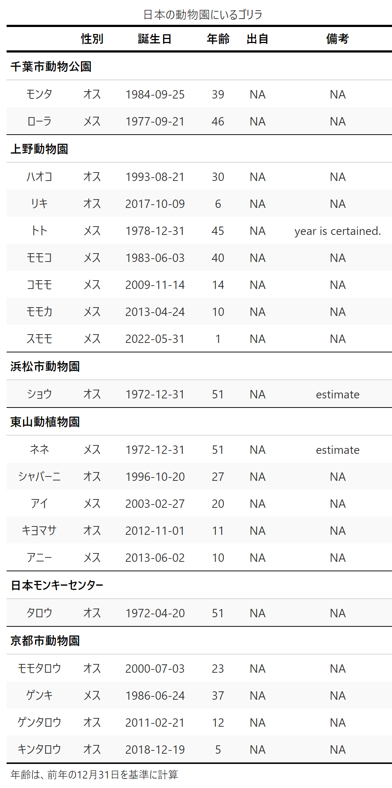

# 動物園のゴリラ
歴代の日本の動物園にいたゴリラの略歴をまとめることを目的とする。

## ゴリラの情報確認
日本動物園水族館協会で公開されている[検索サイト](https://www.jaza.jp/animal/search)を参考に情報整理した（ただし、日本モンキーセンターは検索でヒットしなかった）。

## ゴリラがいる日本の動物園
現在日本の動物園にいるゴリラはすべてニシゴリラで、次の6施設で飼育されている（表 \@ref(tab:member)）。
```{r member, echo = FALSE, out.width = "90%"}

```

# 参考文献
